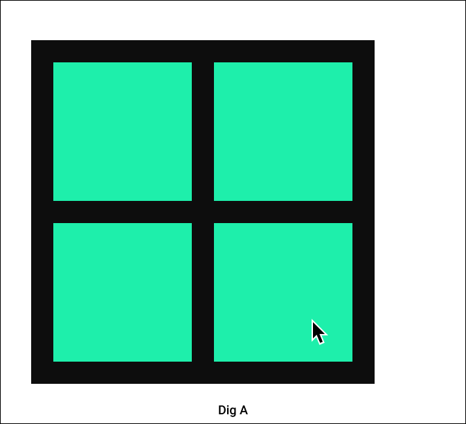
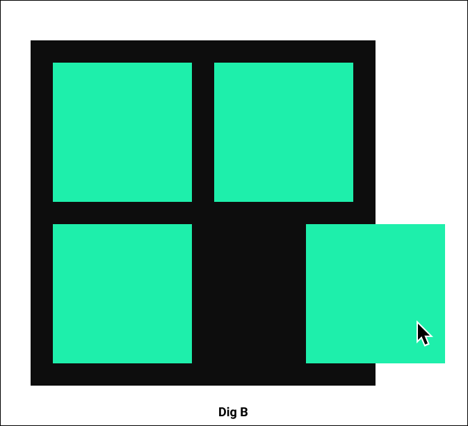
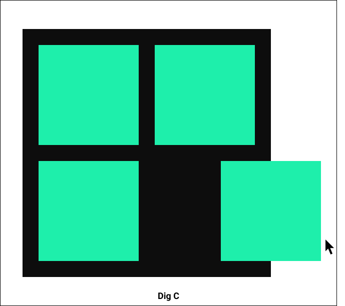
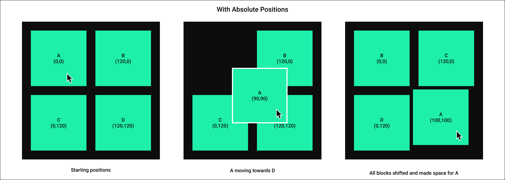
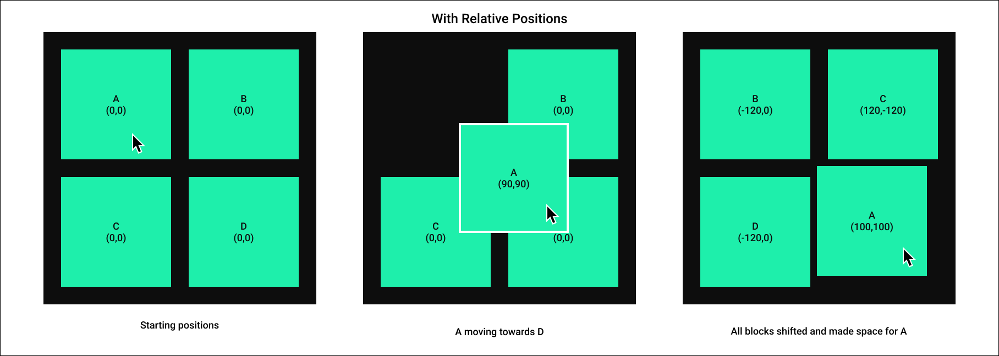
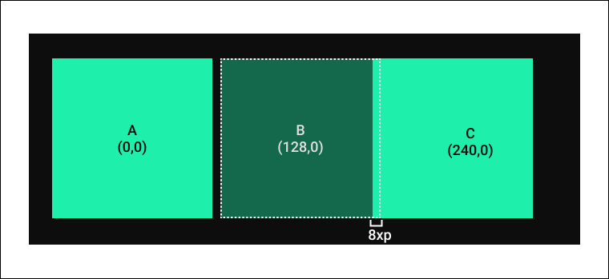

## Creating 2D blocks layout with custom hook useDraggable

The Series

1. [Creating a single draggable block](https://mukulja.in/blog/how-to-create-a-2-d-draggable-grid-with-react-spring-part-1)
2. Creating 2D blocks layout with custom hook useDraggable
3. Rearranging blocks using react-spring [6th June]

We already have a [draggable block](https://gq1co.csb.app/) with dragging logic coupled with the UI component.

<iframe src="https://codesandbox.io/embed/singal-block-fixed-with-parent-gq1co?fontsize=14&hidenavigation=1&theme=dark&view=preview"
     style="width:100%; height:500px; border:0; border-radius: 4px; overflow:hidden;"
     title="singal-block-fixed-with-parent"
     allow="accelerometer; ambient-light-sensor; camera; encrypted-media; geolocation; gyroscope; hid; microphone; midi; payment; usb; vr; xr-spatial-tracking"
     sandbox="allow-forms allow-modals allow-popups allow-presentation allow-same-origin allow-scripts"
   ></iframe>

## Custom hook: useDraggable

Let's take it out the dragging part and create a custom hook that can be used with anything anywhere!

```jsx
import * as React from "react";

const useDraggable = () => {
  const [coordinate, setCoordinate] = React.useState({
    block: {
      x: 0,
      y: 0,
    },
    pointer: { x: 0, y: 0 },
    moving: false,
  });

  const handleMouseMove = React.useCallback(
    (event) => {
      if (!coordinate.moving) {
        return;
      }
      const coordinates = { x: event.clientX, y: event.clientY };

      setCoordinate((prev) => {
        const diff = {
          x: coordinates.x - prev.pointer.x,
          y: coordinates.y - prev.pointer.y,
        };
        return {
          moving: true,
          pointer: coordinates,
          block: { x: prev.block.x + diff.x, y: prev.block.y + diff.y },
        };
      });
    },
    [coordinate.moving]
  );

  const handleMouseUp = React.useCallback(() => {
    setCoordinate((prev) => ({
      ...prev,
      moving: false,
    }));
  }, []);

  const handleMouseDown = React.useCallback((event) => {
    const startingCoordinates = { x: event.clientX, y: event.clientY };
    setCoordinate((prev) => ({
      ...prev,
      pointer: startingCoordinates,
      moving: true,
    }));
    event.stopPropagation();
  }, []);

  return {
    handleMouseDown,
    handleMouseMove,
    handleMouseUp,
    coordinate: coordinate.block,
  };
};

export default useDraggable;
```

### Usage with block

```jsx
const Block = (props) => {
  return (
    <BlockWrapper {...props}>
      <StyledText>1</StyledText>
    </BlockWrapper>
  );
};

export default function App() {
  const { handleMouseDown, handleMouseMove, handleMouseUp, coordinate } =
    useDraggable();

  return (
    <div
      style={{ border: "1px solid", height: "100%", width: "100%" }}
      onMouseMove={handleMouseMove}
      onMouseUp={handleMouseUp}
    >
      <Block
        style={{
          transform: `translate3d(${coordinate.x}px, ${coordinate.y}px, 0px)`,
        }}
        onMouseDown={handleMouseDown}
      />
    </div>
  );
}
```

Let's add more blocks to our layout for adding more block we can use an array and store position of each of block as object in it.

```jsx
const [blocks, setBlocks] = React.useState(
  // creates an array of 10 elements each equals to 1
  new Array(10).fill(1).map(() => ({ x: 0, y: 0 }))
);

...

<BlockContainer
  style={{ border: "1px solid", height: "100%", width: "100%" }}
  onMouseMove={handleMouseMove}
  onMouseUp={handleMouseUp}
>
  {blocks.map((_,index) => (
    <Block
      key={index}
      style={{
        transform: `translate3d(${coordinate.x}px, ${coordinate.y}px, 0px)`
      }}
      onMouseDown={handleMouseDown}
    />
  ))}
</BlockContainer>

```

Somethings wrong and I can feel it!

...

Even if you will move one block they all will move. [Check here](https://f2tbv.csb.app/), **but why?**

<iframe src="https://codesandbox.io/embed/multi-block-moving-together-f2tbv?fontsize=14&hidenavigation=1&theme=dark&view=preview"
     style="width:100%; height:500px; border:0; border-radius: 4px; overflow:hidden;"
     title="multi-block-moving-together"
     allow="accelerometer; ambient-light-sensor; camera; encrypted-media; geolocation; gyroscope; hid; microphone; midi; payment; usb; vr; xr-spatial-tracking"
     sandbox="allow-forms allow-modals allow-popups allow-presentation allow-same-origin allow-scripts"
   ></iframe>

Moving one block is moving every block in same director and with same difference, we have handled it by using the `position: relative` for now! Another thing here to notice is I have changed

```jsx
style={{ top: coordinate.block.y, left: coordinate.block.x }}

// to

style={{
  transform: `translate3d(${coordinate.x}px, ${coordinate.y}px, 0px)`
}}
```

reason being this one is more efficient considering we will be changing these values again-again, when changing `left` or `top` the browser has to run through the layout phase again because `left` or `top` may have changed how things were laid out, `transform` on the other hand will not affect layout.

Layout is not same on all screen sizes, as I have not limited the width height of parent div, blocks spreads according to the space as we are using `flex-wrap` to wrap them and it has it's downsides. If I will limit the width and height dragging will not work properly for the same reason it's was not working for the single block, if moved fast enough pointer will leave the block and might leave our parent div to where the handler are attached, we will change the layout later in this part without limiting the height and width of parent. We will limit that in part 3.

Let's visualize with limited parent height and width with our current handling.

### Dia A

Black area is our parent container and green ones are the blocks. It doesn't matter how fast I drag the pointer inside black area, block will always catch up, there might be bigger jumps in case of fast movements, but it always catch up.



### Dia B

Once pointer left the parent, block will move until the pointer is above it as `handleMouseMove` is still triggered because event current target is block and the propagates to the parent where we are catching the `mouseMove` using `onMouseMove`, it will keep propagating if there is no `event.stopPropagation()`.



### Dia C

Once the pointer left the block `handleMouseMove` will not trigger anymore for the block, note that the `mouseUp` is still not triggered inside block or parent, so we still have `moving: true` in our state and once the pointer reaches inside the parent, there will be wired movements of block, we can handle this while applying checks on `mouseMove` such that our block never leaves the parent, whenever the pointer leaves the parent, trigger `handleMouseUp` manually, there are still some catches that can be resolved using some calculation that we will cover later in part 3.



## Making particular block move

Till now we can drag every block together in any direction as we are maintaining only one state with `useDraggable`, instead of maintaining one state we will maintain an array and each element inside an array will be coordinates of a block at that index!

Change the state to

```jsx
// Grid.jsx

const { handleMouseDown, handleMouseMove, handleMouseUp, blocks } =
  useDraggable(10);

return (
  <BlockContainer onMouseMove={handleMouseMove} onMouseUp={handleMouseUp}>
    {blocks.map((coordinate, index) => (
      <Block
        key={index}
        style={{
          transform: `translate3d(${coordinate.x}px, ${coordinate.y}px, 0px)`,
        }}
        // we will use this to identify the block, to avoid n number of inline function declaration
        data-index={index}
        onMouseDown={handleMouseDown}
      />
    ))}
  </BlockContainer>
);

// useDraggable.js state

const [coordinate, setCoordinate] = React.useState({
  blocks: new Array(totalBlocks).fill(1).map(() => ({ x: 0, y: 0 })),
  pointer: { x: 0, y: 0 },
  // removed `moving` and added `movingBlockIndex` key to track the moving block
  movingBlockIndex: null,
});

const handleMouseDown = React.useCallback((event) => {
  const index = parseInt(event.target.getAttribute("data-index"), 10);
  const startingCoordinates = { x: event.clientX, y: event.clientY };
  setCoordinate((prev) => ({
    ...prev,
    pointer: startingCoordinates,
    // we set this to null on mouseUp
    movingBlockIndex: index,
  }));
  event.stopPropagation();
}, []);
```

## Fixing the layout

As we discussed earlier they layout is not great, though we can definitely limit the heigh and width, but we will do it using `position: absolute`, but isn't that will require more work ? Not actually, Not for the long run!

A grid gives us defined structure to work on as we will be working with coordinates, if one block moves we can shift other blocks to it's position and create space for this one at it's current position like you saw in the [demo](https://gbdgu.csb.app/) with `position: relative` these calculation will be hard as then we will always have to calculate with respect to the block's initial position to move it which will be a nightmare.

Though we will fixing only the layout not blocks re-arrangement in this part but consider these two scenario with position `absolute` & `relative`.




With `position: absolute` everything is natural and easy!

Then why were using `position: relative`? That's best for single block moment or even the grid where we don't have to re-arrange everything, if any block overlaps anyone we can simple move it with some few pixels, like [here](https://agni-web.netlify.app/). So it depends on the case.

It's pretty simple to define a grid, everything has to be place `120px` apart whether horizontal or vertical. On X axis for each block we will multiply by 120 and same will happen for Y axis. Let's say we want only 3 blocks in one row, if we had 9 block the arrangement will look like

```
0 | 1 | 2
__________
3 | 4 | 5
__________
6 | 7 | 8

```

if you notice there is a pattern, column of any index can be determined using `index%3` and row can be determined using floor of `index/3`. So coordinate will be

```js
{
  x: index % 3 * 120,
  y: 120 * Math.floor(rowindex / 3)
}
```

But there will no gap between the blocks and it will probably look bad. Let's add 8px of gap between each block, to do so X coordinate of 1st block will be same as before, we should add 8px to the 2nd block, 16px to the 3rd and so on. Why we are increasing the gap with each block as 8px as been added to 2nd block that will be pushed toward right, now the 3rd one is overlapping the 2nd by 8px so to cover that 8px and to add gap of 8px we have to add 16px, it stays same for upcoming blocks.



```js
{
  x: index % 3 * 120 + (index % 3 * 8),
  y: 120 * Math.floor(rowindex / 3) + (Math.floor(rowindex / 3) * 8)
}
```

Enough talking, the code:

```jsx
const totalBlocks = 10;
const blockInRow = 3;

const blocks = Array(totalBlocks)
  .fill(1)
  .map((_, index) => {
    const col = Math.floor(index % blockInRow);
    const row = Math.floor(index / blockInRow);
    return { x: col * 120 + col * 8, y: 120 * row + row * 8 };
  });
```

You check it working code [here](https://y1tdz.csb.app/)

<iframe src="https://codesandbox.io/embed/multi-block-grid-separate-movement-y1tdz?fontsize=14&hidenavigation=1&theme=dark&view=preview"
     style="width:100%; height:500px; border:0; border-radius: 4px; overflow:hidden;"
     title="multi-block-grid-separate-movement"
     allow="accelerometer; ambient-light-sensor; camera; encrypted-media; geolocation; gyroscope; hid; microphone; midi; payment; usb; vr; xr-spatial-tracking"
     sandbox="allow-forms allow-modals allow-popups allow-presentation allow-same-origin allow-scripts"
   ></iframe>

That's all for today, we have a grid and draggable blocks, in next part will restrict the block movement inside the grid only and will re-arrange them if a block hovers on another using `react-sprint`.
